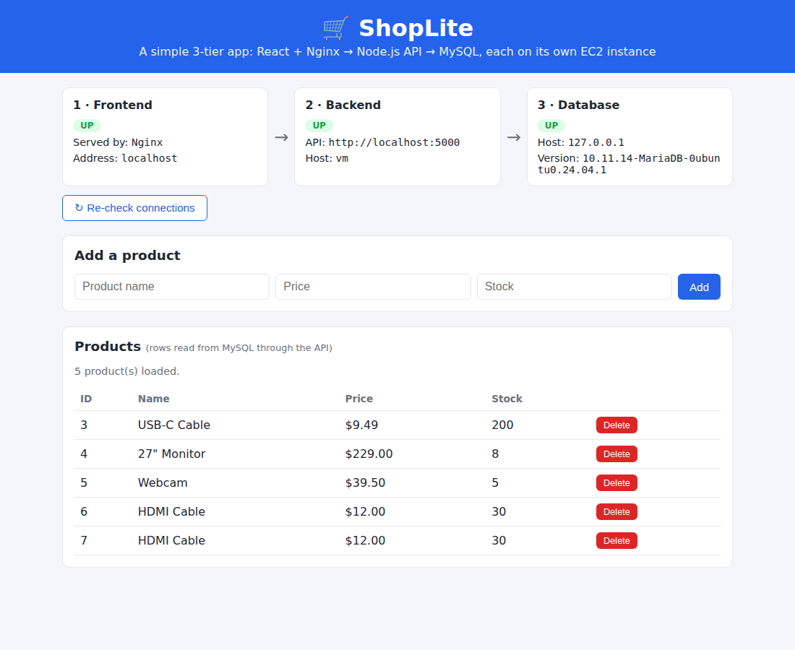

# ShopLite — a simple 3-tier app for teaching EC2 deployment

A small product-inventory app built to demonstrate a classic **3-tier
architecture**, with each tier on its **own EC2 instance**:

| Tier | What | Tech | Port | Runs as |
|------|------|------|------|---------|
| 1. Frontend (presentation) | Web UI | React (Vite), built to static files | 80 | **Nginx** (`nginx` service) |
| 2. Backend (application) | REST API | Node.js + Express + mysql2 | 5000 | systemd service `shoplite-backend` |
| 3. Database (data) | Stores products | MySQL 8 | 3306 | `mysql` service (installed by apt) |



The top of the page is a live **status board** showing each tier: which host
the page was loaded from, which backend answered, and whether that backend can reach
MySQL. Stop a service or break a security-group rule and viewers see the tier
turn **DOWN**.

---

## How the traffic flows

```
                 Internet
                    │
     ┌──────────────┴───────────────┐
     │ (1) GET page                 │ (2) fetch() API calls from the browser
     ▼                              ▼
┌──────────────┐            ┌──────────────┐   (3) SQL over     ┌──────────────┐
│  FRONTEND    │            │   BACKEND    │   PRIVATE IP       │   DATABASE   │
│  EC2 :80     │            │   EC2 :5000  │ ─────────────────► │   EC2 :3306  │
│  public IP   │            │  public IP   │                    │  no public   │
└──────────────┘            └──────────────┘                    │  access      │
                                                                └──────────────┘
```

1. The browser downloads the built React app (HTML/JS/CSS) from **Nginx** on the
   frontend server (`http://FRONTEND_PUBLIC_IP`).
2. The JavaScript **in the browser** calls the **backend** on its **public IP**
   (`http://BACKEND_PUBLIC_IP:5000`). That's why the backend has to be reachable
   from the internet, and why it sends CORS headers.
3. The backend connects to MySQL using the database's **private IP**. The database
   is never exposed to the internet.

### Build time vs run time (worth explaining on camera)

- **Backend:** `.env` is read **every time the service starts**. Change it, then
  `systemctl restart shoplite-backend`. No rebuild.
- **Frontend:** `VITE_API_URL` in `frontend/.env` is **baked into the JavaScript
  when you run `npm run build`**. Nginx only serves the finished files and knows
  nothing about `.env`. If the backend IP changes, you must **rebuild and copy
  `dist/` again**.

---

## Folder layout

```
shoplite/
├── database/
│   ├── schema.sql                  # creates DB `shoplite`, table `products`, sample rows
│   └── create-user.sql             # creates app user `shopuser` for remote access
├── backend/
│   ├── server.js                   # Express API
│   ├── package.json
│   ├── .env.example                # DB_HOST, DB_USER, DB_PASSWORD...
│   └── shoplite-backend.service    # systemd unit
└── frontend/                       # React app (Vite)
    ├── index.html
    ├── src/
    │   ├── main.jsx                # React entry point
    │   ├── App.jsx                 # status board, add form, product table
    │   ├── api.js                  # fetch() calls to the backend
    │   └── style.css
    ├── package.json
    ├── vite.config.js
    ├── .env.example                # VITE_API_URL=http://BACKEND_PUBLIC_IP:5000
    └── nginx/shoplite.conf         # Nginx site config
```

### API endpoints

| Method | Path | Description |
|--------|------|-------------|
| GET | `/api/health` | Backend hostname and DB status/version |
| GET | `/api/products` | List products |
| POST | `/api/products` | Add product: `{"name":"Mouse","price":19.99,"stock":10}` |
| DELETE | `/api/products/:id` | Delete a product |

---

## Step 0: Launch 3 EC2 instances

Use **Ubuntu Server 24.04 LTS**, `t2.micro`/`t3.micro`, all in the **same VPC**
(the default VPC is fine). Name them `shoplite-frontend`, `shoplite-backend`,
`shoplite-db`.

### Security groups

Create one security group per tier. The DB rule that references the **backend's
security group** (not an IP) is a good concept to teach.

| Security group | Inbound rule | Source |
|----------------|--------------|--------|
| `sg-frontend` | SSH 22 | My IP |
|  | HTTP **80** | `0.0.0.0/0` |
| `sg-backend` | SSH 22 | My IP |
|  | Custom TCP **5000** | `0.0.0.0/0` (browsers call it directly) |
| `sg-db` | SSH 22 | My IP |
|  | MySQL/Aurora **3306** | **`sg-backend`** (only the backend can reach the DB) |

Write down these IPs; you'll need them below:

- `DB_PRIVATE_IP`: private IPv4 of `shoplite-db`
- `BACKEND_PUBLIC_IP`: public IPv4 of `shoplite-backend`
- `FRONTEND_PUBLIC_IP`: public IPv4 of `shoplite-frontend`

> Public IPs change when you **stop/start** an instance. If the backend's IP
> changes, update `VITE_API_URL` and rebuild the frontend, or attach an Elastic IP
> to the backend.

Get the code onto each server with `git clone` (below) or `scp`.

---

## Step 1: Database server (`shoplite-db`)

```bash
ssh -i key.pem ubuntu@DB_PUBLIC_IP

sudo apt update
sudo apt install -y mysql-server git
sudo systemctl enable --now mysql
sudo systemctl status mysql

git clone https://github.com/awsdevop183/shoplite.git
cd shoplite/database

# Create database, table and sample data
sudo mysql < schema.sql

# Create the app user. EDIT THE PASSWORD in create-user.sql first!
nano create-user.sql
sudo mysql < create-user.sql
```

**Allow remote connections.** By default MySQL only listens on `127.0.0.1`:

```bash
sudo sed -i 's/^bind-address.*/bind-address = 0.0.0.0/' /etc/mysql/mysql.conf.d/mysqld.cnf
sudo systemctl restart mysql

sudo ss -tlnp | grep 3306      # should now show 0.0.0.0:3306
```

Verify:

```bash
sudo mysql -e "SELECT * FROM shoplite.products;"
sudo mysql -e "SELECT user, host FROM mysql.user WHERE user='shopuser';"
```

---

## Step 2: Backend server (`shoplite-backend`)

```bash
ssh -i key.pem ubuntu@BACKEND_PUBLIC_IP

sudo apt update
sudo apt install -y nodejs npm git mysql-client
node -v

# Optional but good to demo: can this server reach the DB? (uses the DB PRIVATE IP)
mysql -h DB_PRIVATE_IP -u shopuser -p -e "SELECT COUNT(*) FROM shoplite.products;"

git clone https://github.com/awsdevop183/shoplite.git
sudo cp -r shoplite/backend /opt/shoplite-backend
sudo chown -R ubuntu:ubuntu /opt/shoplite-backend
cd /opt/shoplite-backend

npm install

cp .env.example .env
nano .env          # set DB_HOST=DB_PRIVATE_IP and DB_PASSWORD
```

**Run it manually first** (useful for showing what a service *replaces*):

```bash
set -a; source .env; set +a
node server.js
# in another terminal:  curl localhost:5000/api/health
# Ctrl+C to stop
```

**Now make it a Linux service:**

```bash
sudo cp shoplite-backend.service /etc/systemd/system/
sudo systemctl daemon-reload
sudo systemctl enable --now shoplite-backend
sudo systemctl status shoplite-backend
journalctl -u shoplite-backend -f          # live logs (Ctrl+C to exit)
```

**Test from the internet** (your laptop's browser or terminal):

```
http://BACKEND_PUBLIC_IP:5000/api/health
http://BACKEND_PUBLIC_IP:5000/api/products
```

---

## Step 3: Frontend server (`shoplite-frontend`)

```bash
ssh -i key.pem ubuntu@FRONTEND_PUBLIC_IP

sudo apt update
sudo apt install -y nodejs npm git nginx
sudo systemctl enable --now nginx     # visit http://FRONTEND_PUBLIC_IP: Nginx welcome page

git clone https://github.com/awsdevop183/shoplite.git
cd shoplite/frontend
```

**1. Point the app at the backend, then build it:**

```bash
cp .env.example .env
nano .env                  # VITE_API_URL=http://BACKEND_PUBLIC_IP:5000

npm install
npm run build              # creates dist/ with index.html + assets/*.js, *.css
ls dist dist/assets
```

**2. Copy the build to Nginx's web folder:**

```bash
sudo mkdir -p /var/www/shoplite
sudo cp -r dist/* /var/www/shoplite/
```

**3. Configure Nginx to serve it:**

```bash
sudo cp nginx/shoplite.conf /etc/nginx/sites-available/shoplite
sudo ln -s /etc/nginx/sites-available/shoplite /etc/nginx/sites-enabled/
sudo rm /etc/nginx/sites-enabled/default      # remove the welcome page site

sudo nginx -t                                 # always test the config first
sudo systemctl reload nginx
```

Nginx is already a systemd service (installed and enabled by apt), so the
frontend needs no service file of its own. It starts on boot automatically.

**Redeploying after a code or `.env` change:**

```bash
cd ~/shoplite && git pull
cd frontend && npm run build
sudo rm -rf /var/www/shoplite/* && sudo cp -r dist/* /var/www/shoplite/
```

No Nginx restart is needed for new files. Just refresh the browser.

Open the app: **`http://FRONTEND_PUBLIC_IP`**

All three status cards should say **UP**. Add and delete a product, then show
the row in MySQL on the DB server:

```bash
sudo mysql -e "SELECT * FROM shoplite.products;"
```

---

## Demo ideas for the video

| Show this | Do this | What viewers see |
|-----------|---------|------------------|
| Services auto-restart | `sudo kill -9 $(pgrep -f "node server.js")` on backend | Comes back in ~5s (`Restart=always`) |
| Services survive reboot | `sudo reboot` the backend | App works again after boot (`enable`) |
| Frontend down | `sudo systemctl stop nginx` | Page doesn't load at all (connection refused) |
| Backend down | `sudo systemctl stop shoplite-backend` | Backend and DB cards turn **DOWN** |
| DB down | `sudo systemctl stop mysql` on DB server | Backend **UP**, Database **DOWN** (`ECONNREFUSED`) |
| Security groups matter | Remove the 3306 rule from `sg-db` | Database **DOWN**, error `ETIMEDOUT` |
| Security groups matter | Remove the 5000 rule from `sg-backend` | Browser can't reach the API, so Backend **DOWN** |
| DB is private | From your laptop: `mysql -h DB_PUBLIC_IP ...` | Times out, since only `sg-backend` is allowed |
| Build-time config | Put a wrong IP in frontend `.env`, rebuild, copy `dist/` | Backend shows **DOWN** in the UI |
| Built files are static | `ls /var/www/shoplite/assets`, then `grep -o 'http://[0-9.]*:5000' /var/www/shoplite/assets/*.js` | The backend IP is inside the built JS |
| Logs | `journalctl -u shoplite-backend -f` while clicking | Every API request is logged |
| Nginx logs | `sudo tail -f /var/log/nginx/shoplite.access.log` | Every page and asset request |

---

## Troubleshooting

| Symptom | Check |
|---------|-------|
| Page doesn't load at all | `systemctl status nginx`; port 80 open in `sg-frontend`? Using `http://`, not `https://`? |
| Nginx welcome page shows | `default` site still enabled. Remove `/etc/nginx/sites-enabled/default`, then reload |
| `403 Forbidden` or blank page | `dist/` not copied: `ls /var/www/shoplite` should show `index.html` and `assets/` |
| Backend card **DOWN** | `VITE_API_URL` correct? Rebuilt **and** re-copied `dist/` after editing? Port 5000 open in `sg-backend`? |
| Database **DOWN** with `ETIMEDOUT` | `sg-db` allows 3306 from `sg-backend`? `DB_HOST` is the DB's **private** IP? |
| Database **DOWN** with `ECONNREFUSED` | MySQL running? `bind-address = 0.0.0.0` set and MySQL restarted? |
| `ER_ACCESS_DENIED_ERROR` | `DB_USER`/`DB_PASSWORD` in backend `.env` match `create-user.sql`? |
| `ER_BAD_DB_ERROR` | `schema.sql` wasn't run on the DB server |
| Backend service won't start | `journalctl -u shoplite-backend -n 50`. Wrong `WorkingDirectory`? `npm install` skipped? |
| `nginx -t` fails | Read the line number it prints. Usually a missing `;` or `}` |
| `status=217/USER` | The unit runs as `User=ubuntu`. On Amazon Linux change it to `ec2-user` |

### Using Amazon Linux 2023 instead of Ubuntu

- Login user is `ec2-user`, so change `User=` in the backend `.service` file and the `chown` commands.
- `sudo dnf install -y nodejs npm git` for frontend and backend, plus `nginx` on the frontend.
- Nginx has no `sites-available` there: copy the config to `/etc/nginx/conf.d/shoplite.conf`
  and remove the default `server { ... }` block from `/etc/nginx/nginx.conf`.
- MySQL: `sudo dnf install -y mariadb105-server && sudo systemctl enable --now mariadb`.
  MariaDB works with this app unchanged. Its config file is `/etc/my.cnf.d/mariadb-server.cnf`.

---

## Run everything on one machine (for local testing)

```bash
# DB: have MySQL running locally, then
sudo mysql < database/schema.sql && sudo mysql < database/create-user.sql

# Backend
cd backend && npm install
DB_HOST=127.0.0.1 DB_PASSWORD='ChangeMe123!' node server.js

# Frontend (new terminal): Vite dev server with hot reload
cd frontend && npm install
echo "VITE_API_URL=http://localhost:5000" > .env
npm run dev
# open http://localhost:5173
```

## Going further (later lessons)

- Add **HTTPS** with a domain name and Let's Encrypt (`certbot --nginx`).
- Move the backend into a **private subnet** behind an **ALB**, and have Nginx proxy `/api` so the backend needs no public IP.
- Replace the DB EC2 with **Amazon RDS**.
- Store `DB_PASSWORD` in **SSM Parameter Store / Secrets Manager**.
- Automate all of this with **user data**, **Ansible**, or **Terraform**.
